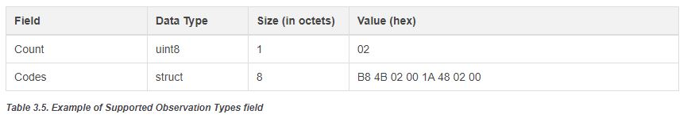
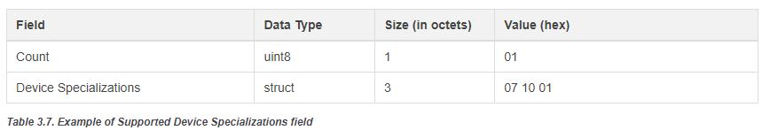
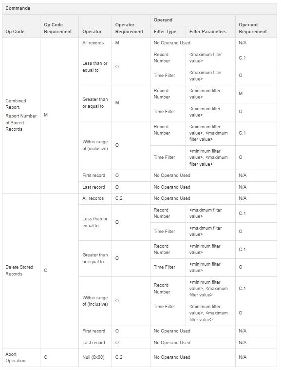
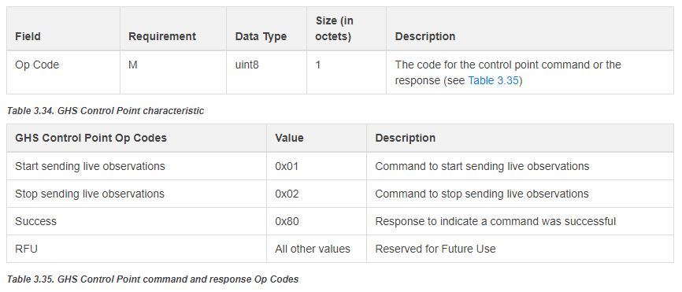

# STM32WBA-BLE-Generic-Health-Sensor

* The STM32WBA-BLE-Generic-Health-Sensor demonstrating Bluetooth® SIG [Generic Health Sensor Profile 1.0](https://www.bluetooth.com/specifications/specs/ghsp-1-0/) example, based on STM32CubeWBA v1.3.1
 
## Hardware Needed

  * This example runs on STM32WBAxx devices.
  * Connect the Nucleo Board to your PC with a USB cable type A to mini-B to ST-LINK connector (USB_STLINK). 

## User's Guide

1) Run this Bluetooth® Low Energy Generic Health Sensor project where the STM32WBA will advertise

2) Use one of the following remote interfaces to interact with your device: <a href="https://wiki.st.com/stm32mcu/wiki/Connectivity:BLE_smartphone_applications#Bluetooth-C2-AE_LE_collector_applications_for_STM32WBA
"> Bluetooth LE collector applications for STM32WBA.</a>
   On the smartphone, download the <a href="https://wiki.st.com/stm32mcu/wiki/Connectivity:BLE_smartphone_applications#Bluetooth-C2-AE_LE_collector_applications_for_STM32WBA
"> Bluetooth LE collector applications for STM32WBA.</a> application.

With the ANDROID/IOS ST BLE Toolbox application to connect with this Bluetooth® Low Energy [Generic Health Sensor Profile 1.0](https://www.bluetooth.com/specifications/specs/ghsp-1-0/) (GHS_XX where XX is the 2 last digit of the Bluetooth® Device Address)
  
   After Connection and Selecting the [Generic Health Sensor Profile 1.0](https://www.bluetooth.com/specifications/specs/ghsp-1-0/) on ANDROID/IOS you will have access to all the GHS Characteristics.
   
   - **Health Sensor Features characteristic**:
      - Byte 0: Flags set to 0x01 => Supported Device Specializations field is present
      - Bytes 1..9: Supported Observation Types
        - Byte 1 Count => number of supported observation types 2
        - Bytes 2..9 Codes => concatenation of the 4-byte codes for the supported observations

        The example implemented is a pulse oximeter sensor that reports blood oxygen saturation and pulse rate observations.

        This example uses the following 4-byte Medical Device Communication (MDC) codes from IEEE 11073-10101:

        MDC_PULS_OXIM_SAT_O2 = 0x00024BB8  and MDC_PULS_OXIM_PULS_RATE = 0x0002481A

        Supported Observation Types bytes in big endian are:
        

            
        

      - Bytes 10..13: Supported Device Specializations
        - Byte 10 Count =>  number of supported device specializations 1
        - Bytes 11..13 Codes => concatenation of tuples consisting of the 2-byte codes for the supported device specializations from the infrastructure partition, 
          partition 8, in IEEE 11073-10101 and their 1-byte version numbers

        The example implemented have a blood pressure monitor Supported Device Specializations. 
        This example uses the following MDC code from IEEE 11073-10101 without the first two bytes that indicate partition 8:
        Code = MDC_DEV_SPEC_PROFILE_BP = 0x00081007; Version = 0x01
        MDC_PULS_OXIM_SAT_O2 = 0x00024BB8  and MDC_PULS_OXIM_PULS_RATE = 0x0002481A
        Supported Device Specializations bytes iun big endian are:
        

            
        

   
   - **Live Health Observations characteristic**:

      Indicated or notified when Start Sending Live Observations Control Point command is sent.
      
      Used by the Generic Health Sensor to report generated observations.

      Here is the observations bytes in big endian generated for oxygen saturation implemented example:

        0x8B,                                 /* Segmentation Header: only one segment First Segment bit 0 and Last Segment bit 1 are set, Rolling Segment Counter on bits 2 to 7
        
        0x01,                                 /* Observation Class Type: Numeric Observation */

        0x1B, 0x00,                           /* Length: 27 bytes */

        0x63, 0x00,                           /* Flags:  OBSERVATION_TYPE_PRESENT | TIME_STAMP_PRESENT | PATIENT_PRESENT | SUPPLEMENT_INFORMATION_PRESENT */

        0xB8, 0x4B, 0x02, 0x00,               /* Observation Type: MDC_PULS_OXIM_SAT_O2 */

        0x22,                                 /* Time Stamp */

        0x72, 0x9D, 0x2B, 0x29, 0x00, 0x00,

        0x06, 0x00,

        0x01,                                 /* Patient */

        0x01,                                 /* Supplemental Information: Count 1 */

        0x3C, 0x4C, 0x02, 0x00,               /*                           Codes MDC_MODALITY_SPOT */

        0x20, 0x02,                           /* Observation Value: Unit Code MDC_DIM_PER_CENT */

        0x62, 0x00, 0x00, 0x00                /*                    Value 98 */

   
   - **Stored Health Observations characteristic**:

      Indicated or notified the Record Access Control Point command.

      Used by the Generic Health Sensor to report generated stored observations, Generic Health Sensor application stores in Stored Health Observations data base each generated Live Heath Observations.

   - **Record Access Control Point characteristic**:

      The Record Access Control Point (RACP) allows to retrieve Stored Health Observations from the server.

      Supported RACP commands are:

      

          
      

      With the following Op Code:

       | Op Code | Value |
       |---|---|
       | Combined Report | 01 |
       | Delete Stored Report | 02 |
       | Abort Operation | 03 |
       | Report Number of Stored Report | 04 |
      
      Operator:                 

       | Operator | Value |
       |---|---|
       | All Records | 01 |
       | Less Than Or Equal To | 02 |
       | Greater Than Or Equal To | 03 |
       | Within Range Of | 04 |
       | First Record | 05 |
       | Last Record: | 06 |
 
      Filter Type implemented is only the Record Number.

      Filter Parameters value depends on the choosen Operator.

      RACP command to get the number of records is: 04 01

      RACP command to get all the records is: 01 01

   - **Generic Health Sensor Control Point characteristic**:

      The GHS Control Point is used to start and stop the sending of live and temporarily stored observations to a client via indications or notifications of the Live Health Observations characteristic during a connection.

      Supported GHS Control Point format and commands are:

      

          
      

3) Use terminal programs like Tera Term to see the logs of each board via the onboard ST-Link. (115200/8/1/n)

## Troubleshooting

**Caution** : Issues and the pull-requests are **not supported** to submit problems or suggestions related to the software delivered in this repository. The STM32WBA-BLE-Generic-Health-Sensor example is being delivered as-is, and not necessarily supported by ST.

**For any other question** related to the product, the hardware performance or characteristics, the tools, the environment, you can submit it to the **ST Community** on the STM32 MCUs related [page](https://community.st.com/s/topic/0TO0X000000BSqSWAW/stm32-mcus).
